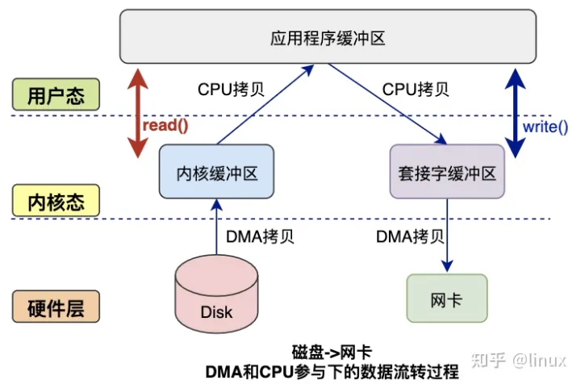
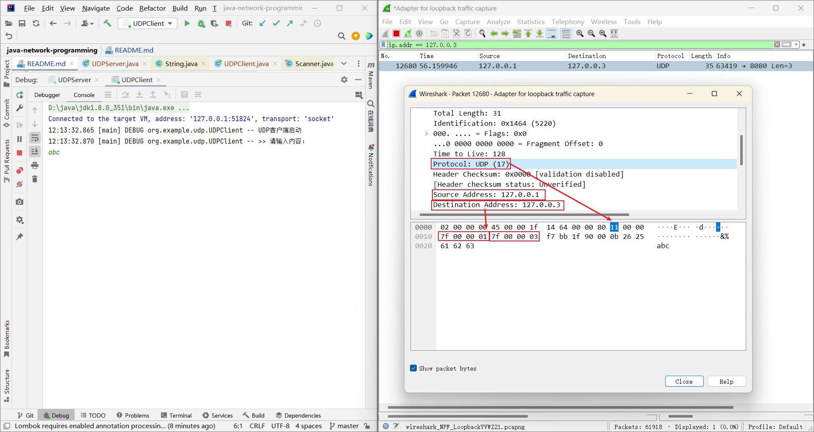
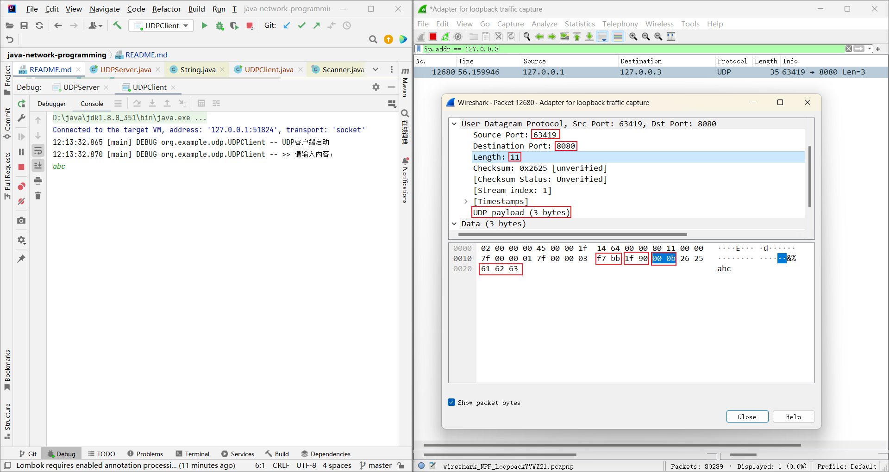
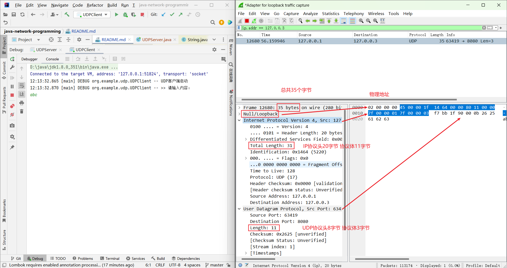

# Java 网络编程

## TCP 编程

粘包、半包、消息边界、大数据无法一次write传输、大数据无法一次read接收

零拷贝  



动态分配缓冲区

+ 方案1 大小不够动态扩容*2 优点简单方便 缺点扩容和复制 性能较差
+ 方案2 缓冲区列表，4K缓冲区，超出新的4K缓冲区，加入到列表 优点不需要复制数据，缺点处理时需要再拼接
+ 方案3 自定义协议，协议头明确数据大小，准确分配具体缓冲区大小，优点 空间资源利用率最高， 缺点自定义协议，实现可能较复杂

### 单线程 阻塞IO Blocking I/O

accept 阻塞的时候，不能 read  
read 阻塞的时候，不能 accept

### 单线程 非阻塞IO Non-blocking I/O

accept read 非阻塞

可正常 accept read 但 CPU 长时间空转 电脑风扇会响 约使用 20% CPU

### 单线程 I/O 多路复用 multiplexing

或叫做事件驱动IO

很好地利用了CPU资源，该阻塞时阻塞，该处理时处理，但单线程没充分利用多核CPU，可改用boss线程负责accept，worker线程负责read和write

```text
// 客户端可读时，触发OP_READ事件， 正常数据 >= 0 客户端正常断开连接 -1  客户端异常断开连接 抛IOException 远程主机强迫关闭了一个现有的连接
public static final int OP_READ = 1 << 0; 
// 读到客户端数据进行处理后，写入客户端，如果没法一次写完，需要注册监听客户端可写事件，等客户端可写时，写入剩余数据
public static final int OP_WRITE = 1 << 2;
public static final int OP_CONNECT = 1 << 3;
// 有客户端连接时，触发OP_ACCEPT事件
public static final int OP_ACCEPT = 1 << 4;
```

### 多线程 I/O 多路复用 

```text
Connected to the target VM, address: '127.0.0.1:54152', transport: 'socket'
17:22:38.068 [main] DEBUG org.example.newio.tcp.MultiThreadIOMultiplexingServer -- boss selecting...
17:22:38.068 [worker-1] DEBUG org.example.newio.tcp.MultiThreadIOMultiplexingServer -- worker selecting...
17:22:38.068 [worker-0] DEBUG org.example.newio.tcp.MultiThreadIOMultiplexingServer -- worker selecting...
17:22:43.560 [main] DEBUG org.example.newio.tcp.MultiThreadIOMultiplexingServer -- client connected java.nio.channels.SocketChannel[connected local=/127.0.0.1:8080 remote=/127.0.0.1:54166]
17:22:43.563 [main] DEBUG org.example.newio.tcp.MultiThreadIOMultiplexingServer -- boss selecting...
17:22:43.563 [worker-0] DEBUG org.example.newio.tcp.MultiThreadIOMultiplexingServer -- worker selecting...
17:22:54.285 [main] DEBUG org.example.newio.tcp.MultiThreadIOMultiplexingServer -- client connected java.nio.channels.SocketChannel[connected local=/127.0.0.1:8080 remote=/127.0.0.1:54170]
17:22:54.286 [main] DEBUG org.example.newio.tcp.MultiThreadIOMultiplexingServer -- boss selecting...
17:22:54.286 [worker-1] DEBUG org.example.newio.tcp.MultiThreadIOMultiplexingServer -- worker selecting...
17:23:20.574 [worker-0] DEBUG org.example.newio.tcp.MultiThreadIOMultiplexingServer -- data read abc
17:23:20.574 [worker-0] DEBUG org.example.newio.tcp.MultiThreadIOMultiplexingServer -- worker selecting...
17:23:26.975 [worker-0] DEBUG org.example.newio.tcp.MultiThreadIOMultiplexingServer -- data read abc
17:23:26.976 [worker-0] DEBUG org.example.newio.tcp.MultiThreadIOMultiplexingServer -- worker selecting...
17:23:42.652 [worker-1] DEBUG org.example.newio.tcp.MultiThreadIOMultiplexingServer -- data read 123
17:23:42.653 [worker-1] DEBUG org.example.newio.tcp.MultiThreadIOMultiplexingServer -- worker selecting...
17:23:43.271 [worker-1] DEBUG org.example.newio.tcp.MultiThreadIOMultiplexingServer -- data read 123
17:23:43.272 [worker-1] DEBUG org.example.newio.tcp.MultiThreadIOMultiplexingServer -- worker selecting...
```

### 信号驱动 signal-driven I/O

### 异步IO asynchronous I/O

Windows 真正实现了 异步IO  
Linux 2.6以后才支持，而且不是真正的 异步IO，底层使用IO多路复用实现

netty 5.x 使用了 异步IO 但性能不但没提升，还让架构更加复杂，作者推荐使用 netty 4.x

### 其他

Server Client 都用调试方式运行 方便调试

调试状态下，可选中代码，再点击 Evaluate Expression

## UDP 编程







自定义协议 底层基于UDP协议

协议头 两个字节 总长度 一个字节序列化类型 两个字节 校验  
协议体 

## Netty

https://github.com/zhouhuajian-course/netty-source-code-analysis